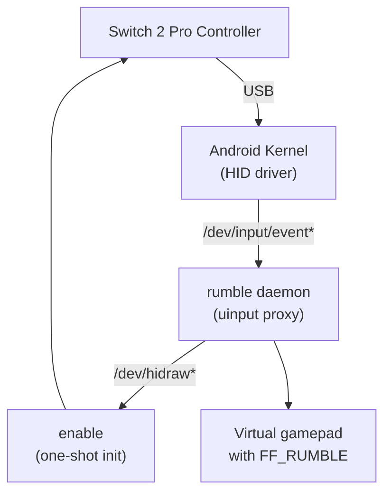

# procon2droid

[](https://github.com/hapqe/procon2droid/actions/workflows/ci.yml)
[](LICENSE)
[](https://en.cppreference.com/w/cpp/20)

> Magisk/KernelSU module that adds **Nintendo Switch 2 Pro Controller** support to Android — with full **HD Rumble**.

**USB only** (not Bluetooth).

---

## Features

- **Full input forwarding** — All buttons, sticks, and sensors work through a virtual uinput device
- **HD Rumble** — Translates Android `FF_RUMBLE` effects into Switch 2 Pro Controller haptic HID reports
- **Zero UI** — Runs entirely headless via Magisk/KernelSU service
- **Lightweight** — Two small statically-linked binaries

---

## Requirements

- Rooted Android device with **Magisk** or **KernelSU**
- Nintendo Switch 2 Pro Controller connected via **USB cable**

---

## Installation

Grab the [latest release](https://github.com/hapqe/procon2droid/releases) and flash the zip in Magisk/KernelSU.

```bash
# Or via Magisk CLI
magisk --install-module procon2droid-v1.1-arm64-v8a.zip
```

Then reboot. The controller will be automatically detected when plugged in.

---

## How it works



1. **`service.sh`** polls `lsusb` for VID `057e` / PID `2069`
2. On detect: runs **`enable`** → sends the 17-packet USB init sequence to wake the controller, then releases the interface back to the kernel
3. Then launches **`rumble`** → creates a virtual uinput device, forwards all input events, and intercepts `EV_FF` rumble commands to translate them into HID haptic reports

---

## Building

### Prerequisites

| Target | Tools |
|--------|-------|
| Tests (native) | CMake, Ninja, Clang, Catch2 (fetched automatically) |
| Android binaries | Android NDK r26+ |

### Run tests

```bash
cmake -S . -B build -G Ninja -DCMAKE_BUILD_TYPE=Release
cmake --build build --target procon2droid_tests
ctest --test-dir build --output-on-failure
```

### Cross-compile for Android

Requires the [Android NDK](https://developer.android.com/ndk/downloads). Set the `ANDROID_NDK_HOME` environment variable to the NDK root, then use the preset:

```bash
# Windows (PowerShell)
$env:ANDROID_NDK_HOME = "C:\path\to\android-ndk"
cmake --preset=android-arm64
cmake --build --preset=android-arm64

# Linux/macOS
export ANDROID_NDK_HOME=/path/to/android-ndk
cmake --preset=android-arm64
cmake --build --preset=android-arm64
```

For `armeabi-v7a`, use the `android-armv7` preset instead.

Or manually:

```bash
cmake -S . -B build_android -G Ninja \
  -DCMAKE_TOOLCHAIN_FILE="$ANDROID_NDK_HOME/build/cmake/android.toolchain.cmake" \
  -DANDROID_ABI=arm64-v8a \
  -DANDROID_PLATFORM=android-24 \
  -DPROCON2DROID_BUILD_TESTS=OFF

cmake --build build_android --target enable rumble
```

## Credits

- Init sequence derived from [HandHeldLegend's procon2tool](https://handheldlegend.github.io/procon2tool/)

---

## License

MIT
